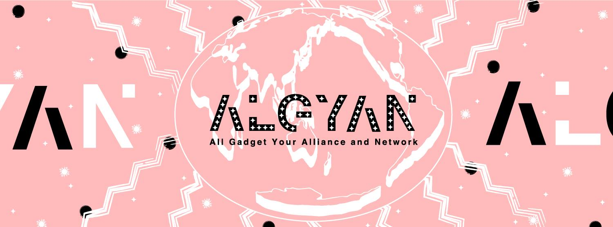

テスト内容

- 見出し
- 文字の装飾
- 箇条書き・番号・チェックリスト
- 引用・コード・コードブロック
- リンク・図表
- emoji, html
- config.yaml

---

## 見出しのテスト

- `#` の数で `<hX>` できる
- `#` はタイトルスライド向き
- `##` までは色が変わる　スライドタイトル向き
- `###` は文字が大きいだけ
- `####` になると本文と同じ大きさ
- `#` の中で空白x2入れても改行にはならない

+++

# てすと1

h1 です  
空白での改行です

空白行です

+++

## てすと2

h2 です  
空白での改行です

空白行です

+++

### てすと3

h3 です  
空白での改行です

空白行です

色が付かなくなります

+++

#### てすと4

h4 です  
空白での改行です

空白行です

見出しは本文と同じくらいの大きさです

+++

# てすと  ですが  なにか

h1の中で空白x2を入れてみた

---

## 文字の装飾

- Markdownの一般的なものが使える
  - 太字：`**`, `__`
  - 斜体：`*`, `_`
  - 打ち消し：`~~`
- 日本語でも前後の空白は無くてよい
  - というか空白がそのまま表示される

+++

`**` による **太字の装飾**   
`__` による __太字の装飾__   

`*` による *斜体の装飾*   
`_` による _斜体の装飾_   

`~~` による ~~打消しの装飾~~   

+++

**文字装飾**の_スペースが_ 無くても ~~良いのか~~のテスト

**文字装飾** の _スペースが_無くても~~良いのか~~ のテスト

---

## 箇条書き・番号

- 箇条書き・番号
  - `- ` `* ` `1.` どちらでもおけ
  - 多段インデントもいける
  - 番号はネストしない（1.1とかにはならない）
  - 前後の空行は無くてよい
- チェックリスト `- []` は綺麗には使えない
- 空白x2入れても改行にはならない
- Fragment Slides良い感じ
  - ネストはそれほど綺麗にはならない

+++

`-` によるもの
- インデント1
- インデント2
- インデント3

`*` によるもの
* インデント1
* インデント2
* インデント3

+++

空行を入れる

- インデント1
- インデント2
- インデント3

空行を入れる

* インデント1
* インデント2
* インデント3

+++

多段の箇条書き

- インデント1
  - インデント1.1
  - インデント1.2
    - インデント1.2.1
    - インデント1.2.2
  - インデント1.3
- インデント2
    - インデント2.1.1
    - インデント2.1.1
  - インデント2.2


+++

番号

1. インデント1
  1. インデント1.1
  1. インデント1.2
    1. インデント1.2.1
    1. インデント1.2.2
  1. インデント1.3
1. インデント2
    1. インデント2.1.1
    1. インデント2.1.1
  1. インデント2.2
2. インデント3
2. インデント4

+++

チェックリスト

- [ ] インデント1
  - [x] インデント1.1
  - [ ] インデント1.2
- [x] インデント2
  - [ ] インデント2.1
  - [x] インデント2.2

+++

長文
すごく長くてすごすごくて長くすごく長くてすごすごくて長くすごく長くてすごすごくて長くすごく長くてすごすごくて長くててててすごく長くてすごすごくて長くて

- すごく長くてすごすごくて長くすごく長くてすごすごくて長くすごく長くてすごすごくて長くすごく長くてすごすごくて長くててててすごく長くてすごすごくて長くて
- すごく長くてすごすごくて長くすごく長くて  すごすごくて長くすごく長くてすごすごくて長くすごく長くてすごすごくて長くててててすごく長くてすごすごくて長くて
  - インデント1.1
  - すごく長くてすごすごくて長くすごく長くてすごすごくて長くすごく長くてすごすごくて長くすごく長くてすごすごくて長くててててすごく長くてすごすごくて長くて
  - インデント1.2

+++

### Fragment Slides

- 要素の先頭を「\-」で記述し |
  - 末尾に「\|」を記述すると 
  - １行ごとの表示単位で     |
- アニメーションができます。|
- アニメーションができます。
- アニメーションができます。|

---

## 引用・コード・コードブロック

- 引用はそれほど綺麗じゃない
- コードはそんなに分からない
  - フォントが変わるだけ
- コードブロックは素敵
- `snap`混ぜるとカッコイイ

+++

> これは引用文です．

> 空行を空けました．

なにか挟んで
> また引用しました

> ２文にまたがって
> 引用しています．

+++ 

`Hello`とか`world`とか

+++

コードブロック

```
#include <stdio.h>

int main(int argc, char *args[])
{
    printf("Hello, world!\n");
    return 0;
}
```

+++

コードブロック by c

```c
#include <stdio.h>

int main(int argc, char *args[])
{
    printf("Hello, world!\n");
    return 0;
}
```

+++

コードブロック by html

```html
<!DOCTYPE html>
<html>
<head>
  <meta charset="utf-8">
</head>
<body>
Hello World！
</body
</html>
```

+++

コードブロック by elixir

```elixir
defmodule Hello do

    def world do
        IO.puts "Hello world"
    end
end

Hello.world
```

+++

@snap[east span-50]
### Fenced Code within<br>Snap Layouts
@snapend

@snap[north-west span-55]
#### Module Aliases
```elixir
alias GenMetrics.GenStage.Manager
alias GenMetrics.GenStage.Monitor
alias GenMetrics.GenStage.Pipeline
alias GenMetrics.Reporter
alias GenMetrics.GenStage.Window
alias GenMetrics.Utils.Runtime
```
@snapend

@snap[south-west span-55]
#### Module Attributes
```elixir
@moduledoc false
@handle_demand :handle_demand
@handle_events :handle_events
@handle_call   :handle_call
@handle_cast   :handle_cast
```
@snapend

---

## リンク・図表

- リンクはベタ書きでも`[]()`でもおけ
  - 別タブで開く設定になる
  - branchは同タブで開く
- 画像はリンク指定でもローカルでも使える
  - サイズ指定がしにくい
  - `snap`をうまく併用するしかないか？
- 表は良い感じ

+++

ベタ書き

https://algyan.github.io/

`[]()`のリンクを使う

[リンクを使う](https://algyan.github.io/)

+++

画像を貼り付け


+++

画像とリンクを併用

[](https://algyan.github.io/)

+++

`snap`と併用？

@snap[north-east span-55]

@snapend

+++

ローカルファイルは？

[README.md](README.md)



branchは？

[howto](howto)

+++

表を使う

|左寄せ|中央|右寄せ|
|:---|:---:|---:|
|左ヒジ左ヒジ|頭も|右ヒジ右ヒジ|
|交互に見て交互に見て|前に出して|交互に見て交互に見て|

---

## emoji,html

- リンクはベタ書きでも`[]()`でもおけ
  - 別タブで開く設定になる
  - branchは同タブで開く
- 画像はリンク指定でもローカルでも使える

+++

emoji

:smile: 

:wink: :mask: :innocent:

:tada:

+++

htmlの直書きのソース

```html
<a href="https://gist.github.com/rxaviers/7360908">
Complete list of github markdown emoji markup
</a><br>
IoT ALGYAN は，<font color="red" size="5">IoTを学べる最強コミュニティ</font>です．<br>

```

+++

htmlの直書きの結果

<a href="https://gist.github.com/rxaviers/7360908">
Complete list of github markdown emoji markup
</a><br>
IoT ALGYAN は，<font color="red" size="5">IoTを学べる最強コミュニティ</font>です．<br>


---

おしまい
