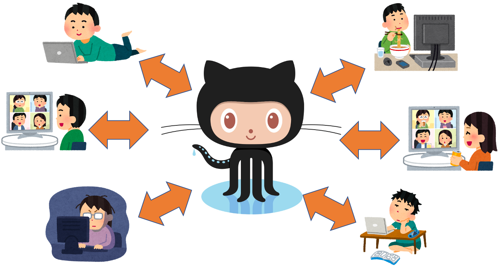
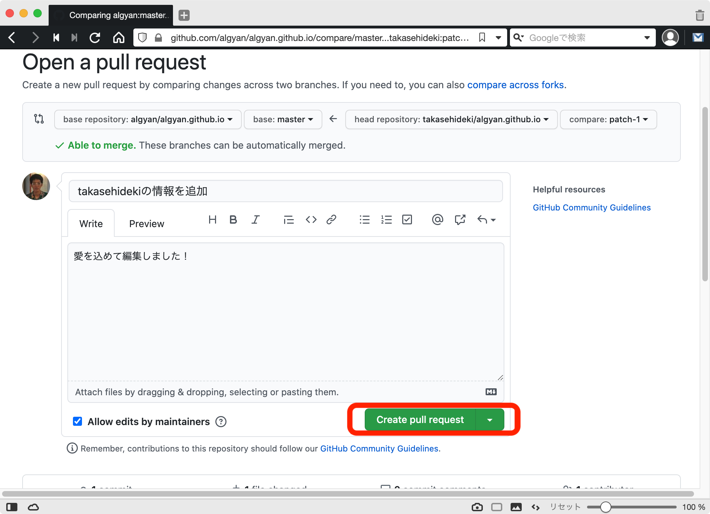
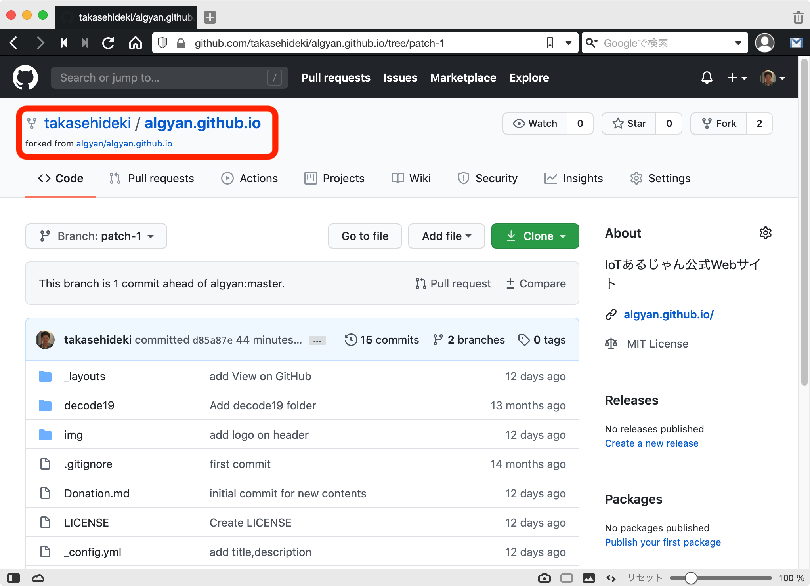
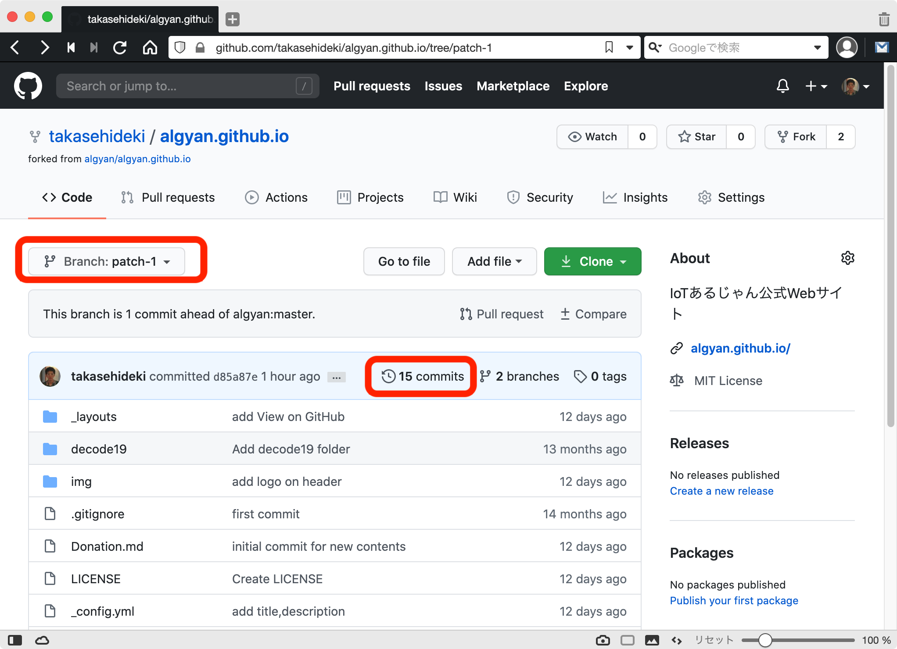
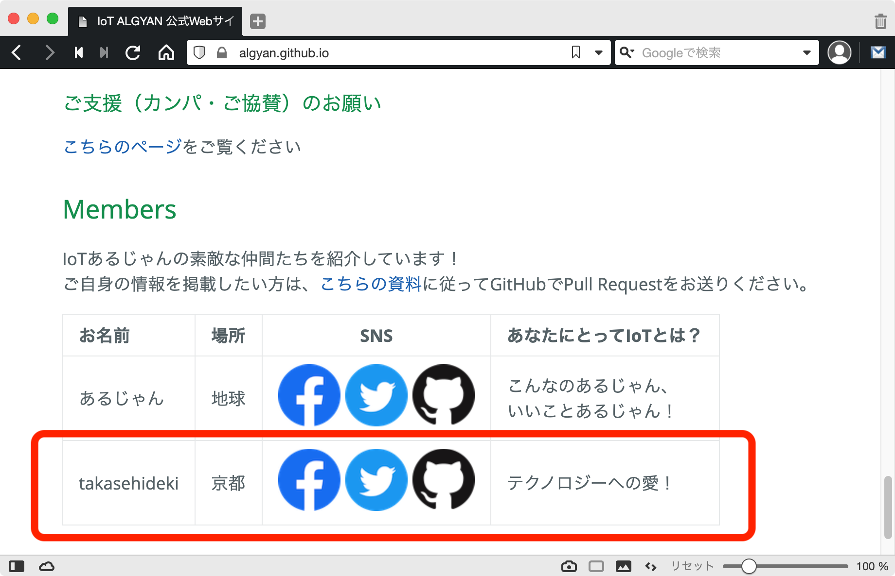
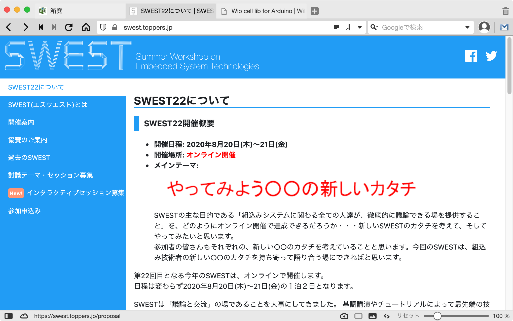

IoTあるじゃん主催  
[今さら聞けないGitHubの使い方あれこれをやさしく学べる入門ハンズオンセミナー！](https://algyan.connpass.com/event/179698/)  

## ３．さぁ、今すぐ一緒に<font color="darkorange">ALGYANのWebサイト構築</font>に参加してみよう！

### <font color="green">@takasehideki</font>

---

@snap[north span-55]
## <font color="green">@takasehideki</font>
@snapend

@snap[north-east span-50]
<br>
<br>
<br>


@snapend

@snap[north-west span-75]
<br>
<br>
<a href="https://github.com/takasehideki"></a>
@snapend

@snap[south-east span-55]
### Follow me!!
<a href="https://github.com/takasehideki"></a>
<a href="https://twitter.com/takasehideki"></a>
<a href="https://facebook.com/takasehideki"></a>
@snapend

@snap[south-west span-65]
#### Organization & Contribution
<font size="6">
<ul>
<li>[tlk-emb](https://github.com/tlk-emb)
<li>[ALGYAN](https://github.com/algyan)
<font size="5">
<ul>
  <li>関西支部長代行補佐
</ul>
</font>
<font size="6">
<li>[toppers](https://github.com/toppers)
<li>[rosjp](https://github.com/ros-japan-users/rosjp.connpass.com)
<li>[NervesJP](https://github.com/nervesjp)
</ul>
</font>
@snapend

---

#### ＿人人人人人人人人＿
#### ＞　突然のステマ　＜
#### ￣Y^Y^Y^Y^Y^Y^Y^Y￣

https://algyan.connpass.com/event/180192/

<a href="https://algyan.connpass.com/event/180192/"></a>

---

GitHubとは,,,
### みんなでコードを育てる場
である！！

- [都の新型コロナ対策サイト、オープンソースで“派生版”続々誕生　全国で30以上、高専生も開発に参加](https://www.itmedia.co.jp/news/articles/2003/23/news130.html)
- [JKが東京都のコロナ対策サイトに貢献した話。OSSに貢献しよう！](https://qiita.com/Anharu/items/572f5f6c30c6edbec349)

---

でも,,,
### OSSコワクナイ？？

---

- 勝手にパクったら怒られるんじゃ,,, |
- OSSライセンス，よくわからない,,, |
- ヒトサマのコードをいじるなんて,,, |
- Issueってケチつけるの失じゃん,,, |
- 編集提案を無視されたらどうしよう,,, |
- そもそもどこに貢献したらいいの,,, |

---

GitHubとは,,,
### <font color="darkorange">**コードを中心としたSNS**</font>
である！！？



---

そんな~~コワガリな~~シャイなあなたに！！

## <font color="darkorange">IoT ALGYAN公式Webサイト</font>

https://algyan.github.io

皆さんで育てていきましょう！！

---

<a href="https://algyan.github.io"></a>

---

<a href="https://algyan.github.io"></a>

---

使っているのは

## GitHubとMarkdown

だけです

##### (詳細は後ほど)

---

### あるじゃん公式WebサイトのMembersに名前を連ねよう！

https://algyan.github.io/#members


---

### やること

1. GitHubにログイン
2. GitHub管理リポジトリにアクセス
3. Webブラウザ上でindex.mdを開く
4. index.mdを編集する
5. Webブラウザ上でポチポチ操作する
6. あら簡単 Pull Requestの出来上がり！

---

### 1. GitHubにログイン

https://github.com/login


ログイン済みの方は次へ →

---

### 2. GitHub管理リポジトリにアクセス

https://github.com/algyan/algyan.github.io


---

### 3. Webブラウザ上でindex.mdを開く

`index.md` を選択して開く


---

### 3. Webブラウザ上でindex.mdを開く

ペンのマークをクリックする  
(`Edit the file in your fork of this project`)


---

### 3. Webブラウザ上でindex.mdを開く

一番下までスクロールしてみよう  
(画像はスクロール前)


---

### 3. Webブラウザ上でindex.mdを開く

一番下までスクロールしてみよう  
(画像はスクロール後)


---

### 4. index.mdを編集する

```
| あるじゃん  | 地球    | [](https://facebook.com/groups/ioytjp/) [](https://twitter.com/IOT_ALGYAN) [](https://github.com/algyan)   | こんなのあるじゃん、<br>いいことあるじゃん！ |
```

などの行をコピペして，自分の情報に編集する．


---

### 4. index.mdを編集する

編集時の注意点
- お１人ずつ１行でコピペして編集してください  （改行が入ると表のレイアウトが崩れます^^;
- お名前はハンドルネームなどでも構いません
- 場所は住んでいるところや出没地など！
- SNSは、Facebook・Twitter・GitHubに対応しています。持っていないもの／掲載したくないものは消してください。
- あなたにとってIoTとは？ひと言お寄せください（セル内で改行を入れたい場合は`<br>`です）

---

### 5. Webブラウザ上でポチポチ操作

Propose changesの欄に編集内容を記入する  
(編集せずに飛ばしても良い)


---

### 5. Webブラウザ上でポチポチ操作

- 1つめは短く分かりやすいと良い
- 2つめは補足説明があればなるべく書く


---

### 5. Webブラウザ上でポチポチ操作

緑色の「<font color="green">Propose changes</font>」をクリックする


---

### 5. Webブラウザ上でポチポチ操作

「<font color="green"> ✔ Able to merge.</font>」が出ていることを確認する


---

### 5. Webブラウザ上でポチポチ操作

「<font color="green">Create pull request</font>」をクリックする


---

### 5. Webブラウザ上でポチポチ操作

次に右下の「<font color="green">Create pull request</font>」をクリックする



---

### 6. Pull Requestの出来上がり！


---

### 中のヒトが変更をチェックするまで
### そのまましばらくお待ちください

#### m(\_ \_)m

ところでなにが起きたの？気になる方は↓へ！

+++

### GitHubの裏側で起きているコト

1. リポジトリを自身のアカウントにFork
2. 編集作業が含まれたbranchを作成
3. Pull Requestを作成

+++

Pull Request画面の  
from <font color="steelblue">(ユーザ名):patch-1</font>  
をクリック


+++

### 1. リポジトリのFork

あるじゃん公式Webサイトの管理リポジトリが  
自身のアカウント配下にコピーされている



+++

### 2. branchの作成 

`patch-1`という名前のbranchが作成されている  
`XX commits`というところを開くとログも見られる



+++

### 3. Pull Requestを作成

管理者に編集の反映をリクエストしている


---

### そろそろかなっ？？

Pull Requestの画面を見てみる  
「Pull request successfully merged and closed」となっていることを確認する


---

### Membersを見てみよう！

https://algyan.github.io/#members



---

### ちなみに，，，

これで晴れて！  
あなたも<font color="coral">あるじゃん公式Webサイト</font>の  
[Contributorsの一員](https://github.com/algyan/algyan.github.io/graphs/contributors)に！！

---

### 最後に大事なこと！

#### GitHubのリポジトリにStarを付けよう

LGMT! 役に立ったありがとう！

Starが増えると中のヒトタチは喜びます


---

## わんもあしんぐ,,,

どうやってGitHubとMarkdownでWebサイトを作っているの？

時間と興味があれば↓へ！

+++

### [GitHub Pages](https://pages.github.com/)を使っています

- 簡単に言えば，GitHubリポジトリにpushした内容がそのままホームページとしてdeployできます．
- htmlやcssをそのままpushしてもOK
- MarkdownファイルをpushしてもOK
  - 静的サイト生成に[Jekyll](https://jekyllrb.com/)がよろしくしてくれます
  - [整形用のテーマ](https://pages.github.com/themes/)を選ぶこともできます

+++

ちなみに過去はこんなのでした,,,

https://algyan.github.io/old/index.html

<a href="https://algyan.github.io/old/index.html"></a>

+++

### ALGYAN公式サイトの作り方

1. `algyan/algyan.github.io` のリポジトリを作る
1. `index.md`を作成してadd, commit, pushする
1. Settings > GitHub Pages
  - Sourceにmasterを選択
  - [Cayman theme](https://pages-themes.github.io/cayman/)をベースとして選択
1. `_layouts/default.html`を追加してlogo画像をthemeに埋込み

+++

### 自分のGitHub Pagesを作りたい！

1. 自身のアカウントに `<ユーザ名>.github.io` のリポジトリを作る
1. `index.html`または`index.md`をadd, commit, push
  - TOPページは `index.md` > `README.md` > `index.html` の順番で優先されるので注意
1. 必要に応じてよしなにcssやThemeを用意する

これだけで `https://<ユーザ名>.github.io` ができる！！ 

+++

### リポジトリでもOK！

1. 自身のアカウントに好きな名前のリポジトリを作る
1. Settings > GitHub Pages
  - Sourceを選ぶ
    - 基本はmaster
    - `docs/`を作って指定するのもアリ
  - 必要に応じてThemeを選択する

`https://<ユーザ名>.github.io/<リポジトリ名>` ができる！！ 

+++

### こんなのができます！

- [TOPPERS/Hakoniwa](https://toppers.github.io/hakoniwa)
  - `web`ブランチでWebサイトのソースを管理
  - [Hugo](https://gohugo.io/)を使って`gh-pages`に静的サイトを生成
- [SWEST](https://swest.toppers.jp)
  - 運営用のプレビューページに`gh-pages`を利用
  - 独自ドメインにもdeployできる
- [Seeed K.K. Wiki](https://seeedjp.github.io/Wiki)
  - [Slate theme](https://pages-themes.github.io/slate/)にメニューバーを追加

#### ＿人人人人人人人人＿
#### ＞　突然のステマ　＜
#### ￣Y^Y^Y^Y^Y^Y^Y^Y￣

+++

https://toppers.github.io/hakoniwa

<a href="https://toppers.github.io/hakoniwa"></a>

+++

https://toppers.github.io/hakoniwa

<a href="https://swest.toppers.jp"></a>

+++

https://seeedjp.github.io/Wiki

<a href="https://seeedjp.github.io/Wiki"></a>


---

GitHubとは,,,
### <font color="darkorange">**コードを中心としたSNS**</font>
である！！！


