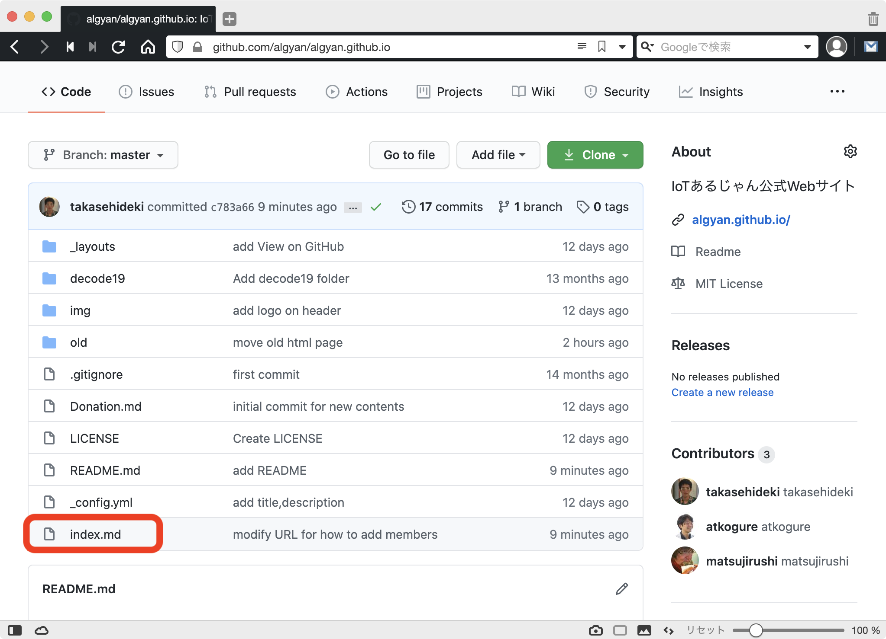
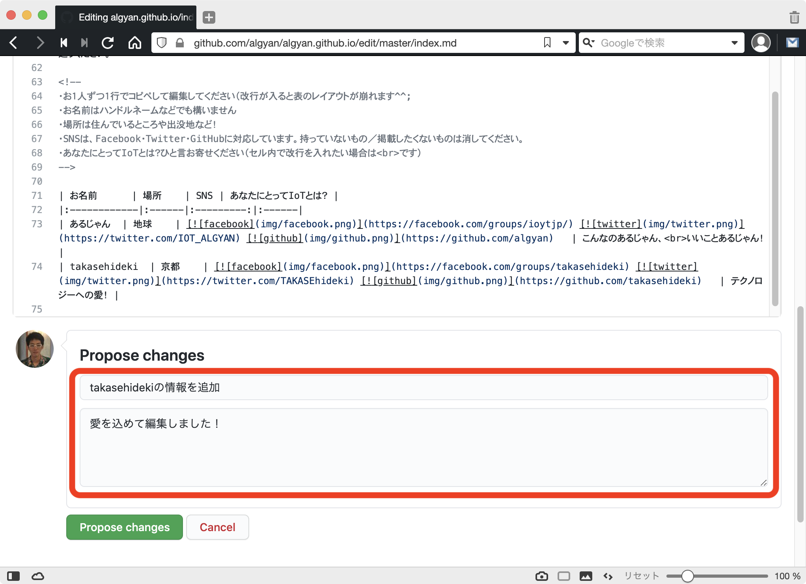

### あるじゃん公式WebサイトのMembersに名前を連ねよう！

https://algyan.github.io/#members


---

### やること

1. GitHubにログイン
2. GitHub管理リポジトリにアクセス
3. Webブラウザ上でindex.mdを開く
4. index.mdを編集する
5. Webブラウザ上でポチポチ操作する
6. あら簡単 Pull Requestの出来上がり！

---

### 1. GitHubにログイン

https://github.com/login


ログイン済みの方は次へ →

---

### 2. GitHub管理リポジトリにアクセス

https://github.com/algyan/algyan.github.io


---

### 3. Webブラウザ上でindex.mdを開く

一番下の `index.md` を開く



---

### 3. Webブラウザ上でindex.mdを開く

ペンのマークをクリックする  
(`Edit the file in your fork of this project`)


---

### 3. Webブラウザ上でindex.mdを開く

一番下までスクロールしてみよう  
(画像はスクロール前)


---

### 3. Webブラウザ上でindex.mdを開く

一番下までスクロールしてみよう  
(画像はスクロール後)


---

### 4. index.mdを編集する

```
| あるじゃん  | 地球    | [](https://facebook.com/groups/ioytjp/) [](https://twitter.com/IOT_ALGYAN) [](https://github.com/algyan)   | こんなのあるじゃん、<br>いいことあるじゃん！ |
```

などの行をコピペして，自分の情報に編集する．


---

### 4. index.mdを編集する

編集時の注意点
- お１人ずつ１行でコピペして編集してください  （改行が入ると表のレイアウトが崩れます^^;
- お名前はハンドルネームなどでも構いません
- 場所は住んでいるところや出没地など！
- SNSは、Facebook・Twitter・GitHubに対応しています。持っていないもの／掲載したくないものは消してください。
- あなたにとってIoTとは？ひと言お寄せください（セル内で改行を入れたい場合は`<br>`です）

---

### 5. Webブラウザ上でポチポチ操作

Propose changesの欄に編集内容を記入する  
(編集せずに飛ばしても良い)
- 1つめはlogに残る 短く分かりやすいと良い
- 2つめは，補足の説明をなるべく詳細に書く



---

### 5. Webブラウザ上でポチポチ操作

緑色の「Propose changes」をクリックする


---

### 5. Webブラウザ上でポチポチ操作

緑色の「✔ Able to merge.」が表示されていることを確認する


---

### 5. Webブラウザ上でポチポチ操作

緑色の「Create pull request」をクリックする


---

### 5. Webブラウザ上でポチポチ操作

右下の「Create pull request」をクリックする


---

### 6. Pull Requestの出来上がり！


